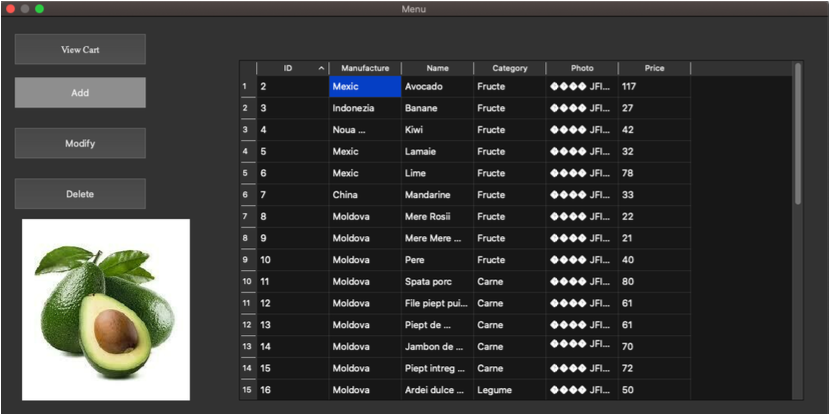
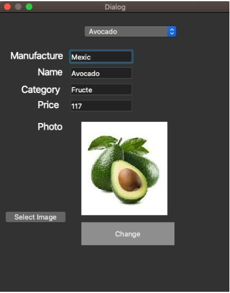
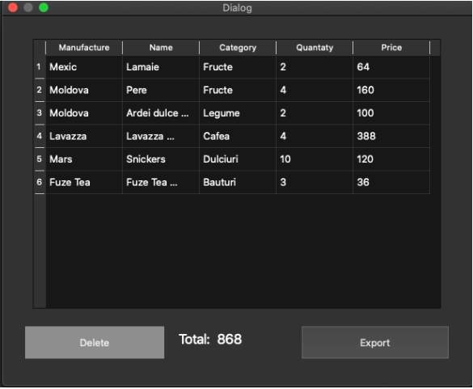

# Qt-Application
This app was created during an internship at an IT company. The app was developed using C++, MySQL, and the for design Qt creator. The app's purpose is to manage the products in a store. As a user, we have the possibility to log in, at first; we see all the products in the store, the buttons on the left give us the option to add a new product, modify an existing one, delete it, or add them to a basket if anything was bought and export a receipt. The app is pretty simple, and unfortunately, it is only in Romanian.  
The login page: 
   
The main menu with all the products and functions: 
 
The page to add a new product: 
  
The basket with the option to export and to delete: 

